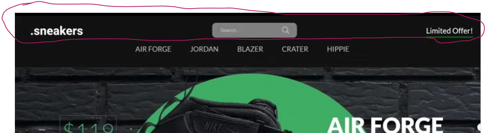
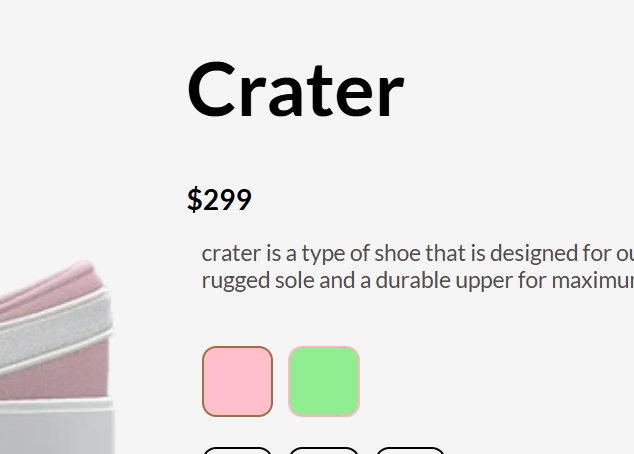

>horizontal distribution-
>outerclass, display:flex,align-items,jcc(daj)
>inner class, items

- used google fonts to download font family
- I  typed in the font-family because that particular css code was not shown to me in the google fonts website
- start with the naviagating bar always
- to get two navigation bars like these,
1.  have **navTop** and **navBottom** as the class names
2. both these are div classes in a nav tag
### top navigation

- 
- 3 div items, instead of list items, we have used navItem
1. logo, 
2. the search box and the icon come under one div prolly so that we can format it together search box
    - no name or value... only class=searchInput is used
    - for the search icon, use fontawesome
3. limited offer 
    - span and not anchor element
### menu items
- they are provided in the bottom border
- each h3 element is given a class 
- you can just use list elements instead
    - selector is .navBottom ul li
    - list-style:none
    - display:inline-block

## slider
- creating sliderWrapper 
- another class sliderItem (each image)
- each image has a circle background. this is implemented by an empty div tag
- each item - img,background circle,title,price,button to buy now
- the main backgorund is not provided for every item
- we give overflow: hidden because otherwise we will get to scroll left to a long spread of white screen
<blockquote>
    <pre>
        .slider{ 
            background: url("images/wavy background.jpg"); 
            background-repeat: no-repeat; 
            background-size:cover; 
            clip-path: polygon(0 0, 100% 0, 100% 100%, 0 81%);  
            overflow:hidden; 
        }
    </pre>
</blockquote>

# css
## body
- font family first
- padding=0
- margin=0

## nav
- background-color, by defualt, this will only span the top header part because it is nav item
- color- is for the limited offer text
- padding: 20px 50px
- this padding is not the one applied for the navItem spacing. i.g this padding is for the overall navigation bar
- <del>this padding is applied to the left of the logo, to the right of "Limited offer" and top and bottom of all the items</del>
    -  it is applied for the elements in it i.e the navTop and navBottom
- 
- the colors are as follows
    - nav: black
    - navTop: green
    - navBottom: blue
    - body: red
    - so the nav spans the entire width but navTop and navBottom don't
    -padding: 20px and 50 px has to be given to get this format
    
    - in this case padding 10 10 5 10 was given
- the problem of navBottom not being contained inside of the nav actually stemmed from giving nav height:40. width:100% is not necessary and padding is also insignificant in this discussion
- padding comes in handy if you are talking about the navtop and navbottom not being contained within the screen limit.
- whenever problems like these occur i.e colors not spanning properly, give new colors to each div to see who the actual problem is.    
- even if i provide padding:10px, the bottom padding seems greater than the others

### .navTop
- display
    - flex
    - so that they can be placed as commodities that have even space between them
- align-items
    - center
    - what would happen if i didn't specify center
- justify-content
- right now navTop is taking the whole space of nav tag(i.e where will navBottom go?)

## .search 
- main aim is to give the color of the final search box that will come in the website
- display
    - flex
- align-items
    - center. 
    - before center, the search icon and text space where placed such that they were at an equal distance from the logo and the limited offer
    - after center, the search bar and the icon come in the exact center of the screen.
- background-color
    - the background color of the text box and the search icon is now grey
- padding
    - it will increase the width and height of the grey background area
- border-radius
    - for the background color

## .search input
- main aim is to make the input textbox invisible
- border:none
    - important because there is a default 3d border for input 
    - this is to be given to the input element in the search class and not just the search class
- background-color:transparent
    - not toBCW: none
- display
## .searchInput::placeholder
- main aim: the placeholder text becomes invisible because of the above background-color being transparent
- give text color here
- : is for pseudo classes whereas :: is for pseudo elements
- pseudo classes represent the state of an element  
- input:focus will bolden the border which was prolly done by changing border thickness of the surrounding box

## .limitedOffer
- font size, bottom border (not underline because it is not a link element) ,cursor pointer

## .navBottom 
- just like navTop
- the margin-right in this is applied to the menuItem
- margin-right is not the spacing in between, it is the distance frim the right margin of the screen
- for different margin-right in .navBottom, we'll obeserve the menuItem jordan going away from the right end and into out view.

## .menuItem
- mr 50 px
- margin right in this case is similar to being able to adjust the space between contents(- justify-content:space-between)
- see how all of them are aligned in the center 
- cursor
- font-weight
# slider wrapper
    - slider, sliderWrapper,sliderItem
## .slider
- background=url("  ")
- clippy generated assymetrical image
- applies the same background to everyone
- had we not provided display:flex, then each item would be listed down with the same background image (the image is not being shared but rather being repeated for every item)
- background-repeat:none is important because otherwise the background image is forming a collage of four of the same images probably because the image size does not fit

-clippy is used to add the circle border
    - similar to rgba selector

## sliderWrapper
- it is for the sliding mechanism
- slider is mainly used to appy the same background
- display:flex
- width:500vw
 
 
 
- flex will go beyond the view width
- polygon will go beyond the view width
-- why are we making the width of flex = 500?
-500 because 5 images and each image is taking 100px
    - we explicitylt say 100px for each image
- but why do we expand it

## slider item
- width
- display:flex because for each element we have things like text,price,button. Their display is provided by flex
- align-items center will not position the heading in the center but rather the words of the text will be centered within an imaginary textbox
- jcc(justify-contents:center;)
- <blockquote>
    <h4>coordinate positioning</h4>
    - use position:relative and then provide top,right,left,bottom  
    - to give dimensions of top, right and left<del> wrt to a parent element</del> considering only the div and not the entire screen, provide position:relative in the parent element

</blockquote>
<!-- without the following space, problems will not be interpreted as a heading -->

## problems
-  the body became squashed to a 10cm band
-  because of absolute positoning 
-  this is where the need for providing 100vh and etc height to sliderItem etc

n-th child
- to apply different properties to the elements in the same flex box
- you apply the set of the same properties to the elements by using a class selector and the different properties using the n-th child property

## slider mechanism
- what to slide
- what should trigger the slide
  
- the entire screen is being slided, so import slideWrapper
- clicking on the menuItem i.e the h3s on the nav bar should trigger it
    - what exactly the trigger is (here it is to click)

-  wrapper.style.transform=`translateX(${-100*index}vw)`; this piece of code will not work if you don't put it in `` ntbcw ''

# features of the company
- padding is applied to the container since it has to be applied to all the elements inside it
<blockquote>display:flex;</blockquote>   

- for making items in a container flow horizontally
<blockquote>
    display:flex; 
    flex-direction: column;
</blockquote>

# product description
- when we click the buy now button, we should scroll down and display the details of the corresponding product

### initial thoughts
- we might use wrapper.style.transform right??

https://github.com/cisa-cell/shoe-e-commerce-website/blob/0b9f14b81b147030a8145db484109c490dfcc967/styles.css#L328-L336

- the sizes came in the top left corner of their respective boxes because we left out daj (display,align-items,justify )

- it's imp that the color boxes and the size boxes are the same height and width and that the space between is the same. 
    - we added border of the same color to each of the color boxes because I realised that after i put the border for the size boxes, even if the rest of the dimensions were the same, the space between did not match.. so I simply made it even and added a border.

- an issue came up because we put the border like this. 

- so now we will change the border colors along with the background color of the currentProduct